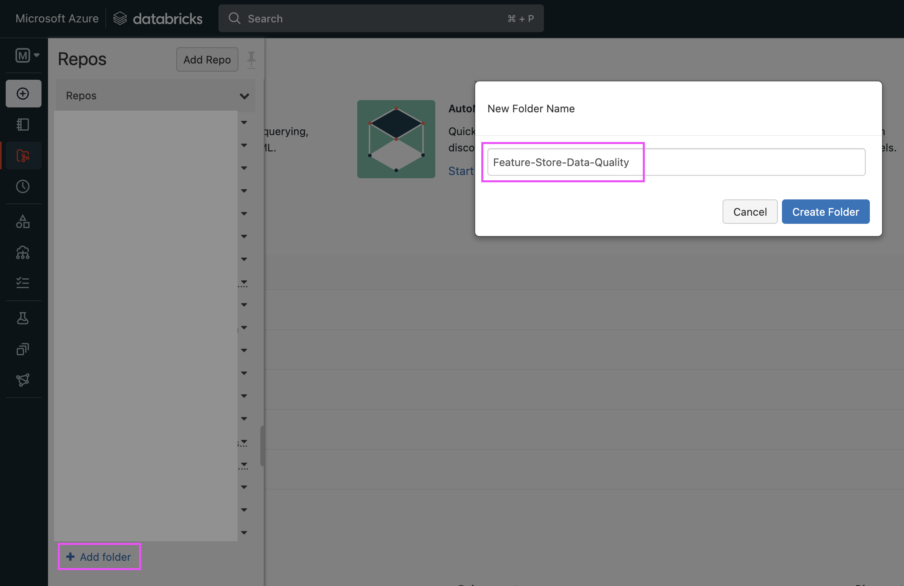

# Table of Contents
- [Table of Contents](#table-of-contents)
- [Overview](#overview)
- [Get Started ](#get-started-)
    - [Option 1: Via Databricks UI (no CI/CD): ](#option-1-via-databricks-ui-no-cicd-)
    - [Option 2: Local Mode with Terraform (no CI/CD): ](#option-2-local-mode-with-terraform-no-cicd-)
    - [Option 3: Via GitHub Actions: ](#option-3-via-github-actions-)
- [Feature Engineering Code ](#feature-engineering-code-)
- [Terraform Walkthrough ](#terraform-walkthrough-)
- [GitHub Actions Logic ](#github-actions-logic-)
  
# Overview
In this example, we showcase how you can enforce data quality when performing feature engineering in Databricks. We'll make use of the Instacart Market Basket Analysis dataset from Kaggle and demostrate how Databricks' Delta Live Tables (DLT) can be used for this.

A sample CI/CD setup using GitHub actions is also included. The GitHub actions uses Databricks CLI and Databricks Terraform provider to deploy a Databricks Job (multi-task job with DLT and notebooks) to a Databricks workspace. 

We hope that these examples will be helpful for anyone who is designing and setting up their MLOps pipeline in Databricks.

# Get Started <a name="get_started"></a>
Clone this repository to get started. There are a few ways for you to test out the content in this repo.

### Option 1: Via Databricks UI (no CI/CD): <a name="via_ui"></a>
**Step 1: Git Setup**

1. [Generate a GitHub personal access token](https://docs.github.com/en/authentication/keeping-your-account-and-data-secure/creating-a-personal-access-token). This will be used by Databricks Repos to access your GitHub repository.

2. In Databricks workspace, [set up your git provider and credentials](https://docs.databricks.com/repos/set-up-git-integration.html) by using your GitHub personal access token.
   
3. In Databricks workspace, under the "Repos" section, add a repo that links to your GitHub repository.

4. Explore the files within Databricks workspace and manually create any DLT pipeline or Job as you like.


### Option 2: Local Mode with Terraform (no CI/CD): <a name="local_mode"></a>
**Step 1: Git Setup**

1. [Generate a GitHub personal access token](https://docs.github.com/en/authentication/keeping-your-account-and-data-secure/creating-a-personal-access-token). This will be used by Databricks Repos to access your GitHub repository.

2. In Databricks workspace, [set up your git provider and credentials](https://docs.databricks.com/repos/set-up-git-integration.html) by using your GitHub personal access token.

**Step 2: Setup and configure [Databricks CLI on your local machine](https://docs.databricks.com/dev-tools/cli/index.html).**

**Step 3: Terraform Setup**

1. Ensure that Terraform is installed in your local machine: https://learn.hashicorp.com/tutorials/terraform/install-cli.

2. Configure Terraform to maintain Terraform state locally by commenting the entire backend block out in [init.tf](terraform/init.tf).
   
   ```terraform
   #terraform {
   #   backend "s3" {
   #     bucket = "chang-feature-store-blog-tf-bucket"
   #     key    = "terraform.tfstate"
   #     region = "ap-southeast-1"
   #   }
   # }
   ```

**Step 4: Run Terraform to deploy resources** 
1. In Databricks workspace, go to Repos and create folder named "Feature-Store-Data-Quality".
   
   
   
   The folder name should match the repo name stated in the [main.tf](terraform/main.tf) and [onPush.yml](.github/workflows/onPush.yml)

   ```terraform
   #main.tf
   variable "repo_path" {
   default     = "/Repos/Feature-Store-Data-Quality/code-repo"
   description = "Path where repo is created"
   type        = string
   }
   ```

   ```yml
   #onPush.yml
   DATABRICKS_REPO_PATH: /Repos/Feature-Store-Data-Quality/code-repo
   ```

2. Run the following commands and a Databricks Job will be deployed by Terraform.
   ```bash
   cd terraform
   terraform init
   terraform apply
   ```

### Option 3: Via GitHub Actions: <a name="via_gh_actions"></a>
**Step 1: Git Setup**

1. [Generate a GitHub personal access token](https://docs.github.com/en/authentication/keeping-your-account-and-data-secure/creating-a-personal-access-token). This will be used by Databricks Repos to access your GitHub repository
   
2. In Databricks workspace, [set up your git provider and credentials](https://docs.databricks.com/repos/set-up-git-integration.html) by using your GitHub personal access token

**Step 2: Generate Databricks personal access token. This is required for GitHub actions to deploy to your Databricks workspace.**

1. [Generate a Databricks personal access token](https://docs.databricks.com/dev-tools/api/latest/authentication.html)

2. In your GitHub repo, store the following secrets:
   * DB_HOST: Host name of your Databricks workspace
   * DB_TOKEN: Your Databricks personal access token

Note: Generally, Databricks recommend the use of Service Principal instead of personal access token for CI/CD orchestration. For the ease of setup, personal access token is used here.

**Step 3: Terraform Setup**

1. Configure your Terraform to use a backend of your choice by updating the file [init.tf](terraform/init.tf). For our case, we used a simple S3 bucket in AWS as our Terraform backend.

2. In [GitHub actions yml file](.github/workflows/onPush.yml), update the block below based on your backend provider. For our case, we used AWS as our backend.
   
   ```yml
   # Update to your preferred backend
   - name: Configure AWS Credentials Action For GitHub Actions
      uses: aws-actions/configure-aws-credentials@v1
      with:
         aws-access-key-id: ${{ secrets.AWS_ACCESS_KEY_ID }}
         aws-secret-access-key: ${{ secrets.AWS_SECRET_ACCESS_KEY }}
         aws-region: ap-southeast-1
   ```      

3. In your GitHub repo, store the secrets for your backend provider. For our case, we store 4 secrets in total:
   * DB_HOST
   * DB_TOKEN
   * AWS_ACCESS_KEY_ID
   * AWS_SECRET_ACCESS_KEY

**Step 4 Run Terraform to deploy resources**
1. In Databricks workspace, go to Repos and create folder named "Feature-Store-Data-Quality".
   
   
   
   The folder name should match the repo name stated in the [main.tf](terraform/main.tf) and [onPush.yml](.github/workflows/onPush.yml)

   ```terraform
   #main.tf
   variable "repo_path" {
   default     = "/Repos/Feature-Store-Data-Quality/code-repo"
   description = "Path where repo is created"
   type        = string
   }
   ```

   ```yml
   #onPush.yml
   DATABRICKS_REPO_PATH: /Repos/Feature-Store-Data-Quality/code-repo
   ```

2. Commit and push your code to master branch. GitHub actions will be triggered and a Databricks Job will be deployed. 

# Feature Engineering Code <a name="feature_engineering_code"></a>
For an overview on the feature engineering code, please refer [here](app/README.md).

# Terraform Walkthrough <a name="terraform_walkthrough"></a>
For an overview on Terraform's setup, please refer [here](terraform/README.md)

# GitHub Actions Logic <a name="gh_action_logic"></a>
The logic of the sample GitHub actions is as follow:
1. Initialize and setup runner
2. Create repo if it doesn't exists in Databricks workspace
3. Update repo with the latest commit
4. Calls Terraform to deploy the DLT and Databricks job